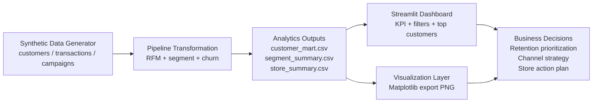

# Architecture Notes

## Positioning

This repository should be presented as a business decision intelligence platform.

## Suggested interview story

1. Start from business pain:
   - customer value visibility is fragmented
   - marketing actions are not prioritized
   - store/channel performance lacks a unified decision view
2. Explain architecture:
   - synthetic source layer simulates CRM + transaction + campaign feeds
   - transformation layer builds customer mart
   - semantic business layer exposes segment / churn / value metrics
   - application layer visualizes KPI and prioritization
3. Explain extension potential:
   - replace CSV with warehouse tables
   - add dbt or orchestration
   - add model serving / scoring API
   - plug into BI tools or agent workflows

## Mermaid architecture diagram

## Business capability mapping

- **Segment strategy**: VIP/Loyal/Growth/At Risk segmentation logic with explicit rules.
- **Retention prioritization**: recency-driven churn risk classes surfaced in dashboard filters.
- **Channel insight**: campaign open and conversion rates rendered into executive-friendly visuals.
- **Executive reporting**: charts + tabular summaries suitable for walkthroughs with non-technical stakeholders.
